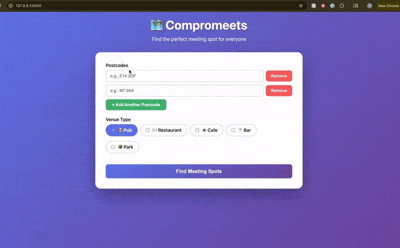

A Python app for finding where to meet, between multiple people.



# Usage

Download the required map files from the list below, then make sure the names line up with the paths in `notebooks/isochrone_testing.ipynb`.

To load environment variables from your local `.env` file into `uv`, add the following to your `.zshrc`:

```sh
# load .env if it exists in the current directory
_set_uv_env_file() {
    if [-f .env]; then
        export UV_ENV_FILE=.env
    else
        unset UV_ENV_FILE
    fi
}

# reset when changing directories
autoload -U add-zsh-hook
add-zsh-hook chpwd _set_uv_env_file

# set initially
_set_uv_env_file
```

You will need `GOOGLE_PLACES_API_KEY` to be set.

For LLM-based venue suggestions (optional), also set `ANTHROPIC_API_KEY` in your `.env` file.

Once that's all done, you can run the app. For now, it uses a simple template-based frontend on top of a FastAPI backend. Make sure [`uv`](https://docs.astral.sh/uv/getting-started/installation/) is installed and kick off the service with `uv run fastapi dev compromeets/app/main.py`.

## API Usage

The `/suggest` endpoint supports two modes:

**Algorithm-based (default)**: Uses isochrone analysis and Google Places API
```bash
curl -X POST http://localhost:8000/suggest \
  -H "Content-Type: application/json" \
  -d '{
    "postcodes": ["N7 8LT", "SW1A 1AA"],
    "types": ["restaurant", "bar"]
  }'
```

**LLM-based**: Uses Claude Sonnet 4.5 with prompt caching
```bash
curl -X POST http://localhost:8000/suggest \
  -H "Content-Type: application/json" \
  -d '{
    "postcodes": ["N7 8LT", "SW1A 1AA"],
    "types": ["sports pub"],
    "use_llm": true,
    "preference": "equidistance"
  }'
```

Available preferences for LLM mode: `equidistance`, `minimum_overall_travel_time`, `best_rating`, `affordability`

# Open source maps

- [Protomaps](https://protomaps.com/) (Regional)
- [Geofabrik](https://download.geofabrik.de/europe/united-kingdom/england/greater-london.html) (City-level)
- [BODS (Bus Data)](https://data.bus-data.dft.gov.uk/timetable/download/)
- [TfL Journey Planner (Tube, DLR, Tram)](http://tfl.gov.uk/journey-planner-timetables.zip)
- [ONS Postcodes](https://geoportal.statistics.gov.uk/search?tags=onspd)
- [NaPTAN Stop Data (Use CSV)](https://beta-naptan.dft.gov.uk/Download/National)

# Appendix: alternative frameworks

- Alternatives to Google Places API: [SERP](https://medium.com/@paulotaylor/google-places-api-alternatives-a-guide-to-save-you-big-money-with-genai-774605e04769)

# TODO

- The package falls back to 0 when it can't find latlong stop data, which is not ideal behaviour. It also can't handle the Easting Northing format given by TfL. Currently we are fixing this in post during ingestion, but worth fixing at source: https://github.com/planarnetwork/transxchange2gtfs/blob/0132c0b04c84a490083ec44ab9d026f064cf010e/src/transxchange/TransXChangeStream.ts#L78
- Check that all calendar dates for schedules are provided and find workarounds if not
- Make inference pipeline
- Make ingestion pipeline
- Add pydantic models

# Appendix: TransXChange to GTFS conversion

The project uses the Node.js [`transxchange2gtfs`](https://github.com/planarnetwork/transxchange2gtfs) tool for converting TransXChange timetable data to GTFS format. This is wrapped in a Python interface for ease of use.

## Setup

1. Install Node.js (if not already installed):

   ```bash
   brew install node  # macOS
   # or use nvm for version management
   ```

2. Install the transxchange2gtfs tool:
   ```bash
   cd tools/transxchange2gtfs
   npm install
   ```

## Usage

```python
from compromeets.data.ingest.transxchange import convert_transxchange_to_gtfs

convert_transxchange_to_gtfs(
    input_path="compromeets/artifacts/bods_transxchange/operator.zip",
    output_path="compromeets/artifacts/bods_gtfs.zip"
)
```

Or via the command line:

```bash
uv run python scripts/ingest_transxchange.py input.zip output-gtfs.zip
```

## Notes

- The tool automatically downloads NaPTAN stop data on first run
- Large datasets may require increasing Node.js memory (handled automatically)
- License: The transxchange2gtfs tool is licensed under GNU GPLv3

## Appendix: trans2gtfs updates (deprecated Python package)

Things to update in `transx2gtfs` if needed (at the moment all the necessary open source transit data is already in GTFS):

- deprecate `append()`
- update URL for stops from `naptan.app` to new one
- Handle missing enddate change

```python
# replace
section_ref = jp.JourneyPatternSectionRefs.cdata
# with:
if isinstance(jp.JourneyPatternSectionRefs, list): # If it's a list, take the first one
section_ref = jp.JourneyPatternSectionRefs[0].cdata
else:
section_ref = jp.JourneyPatternSectionRefs.cdata

# Likewise

# Route Section reference (might be needed somewhere) - can be a single element or a list

if isinstance(r.RouteSectionRef, list): # If it's a list, take the first one
    route_section_id = r.RouteSectionRef[0].cdata
else: # Single element
    route_section_id = r.RouteSectionRef.cdata

# and

# Service description - may not exist

if hasattr(service, 'Description') and hasattr(service.Description, 'cdata'):
    service_description = service.Description.cdata
else:
    service_description = "" # Empty string if Description is missing

mode = get_mode(service.Mode.cdata if hasattr(service, 'Mode') else 'bus')

# get_route_tye:

mode = data.TransXChange.Services.Service.Mode.cdata if hasattr(data.TransXChange.Services.Service, 'Mode') else 'bus'
```
